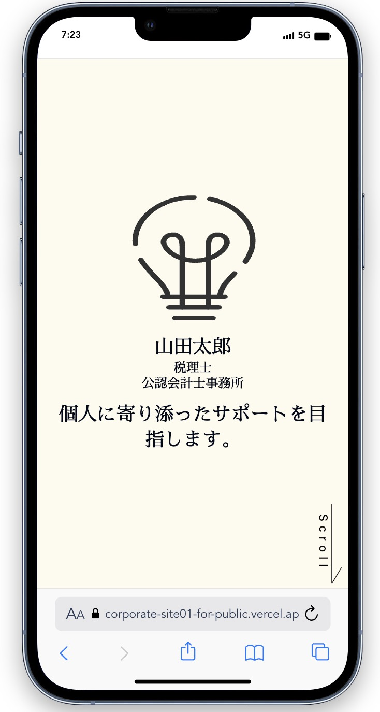
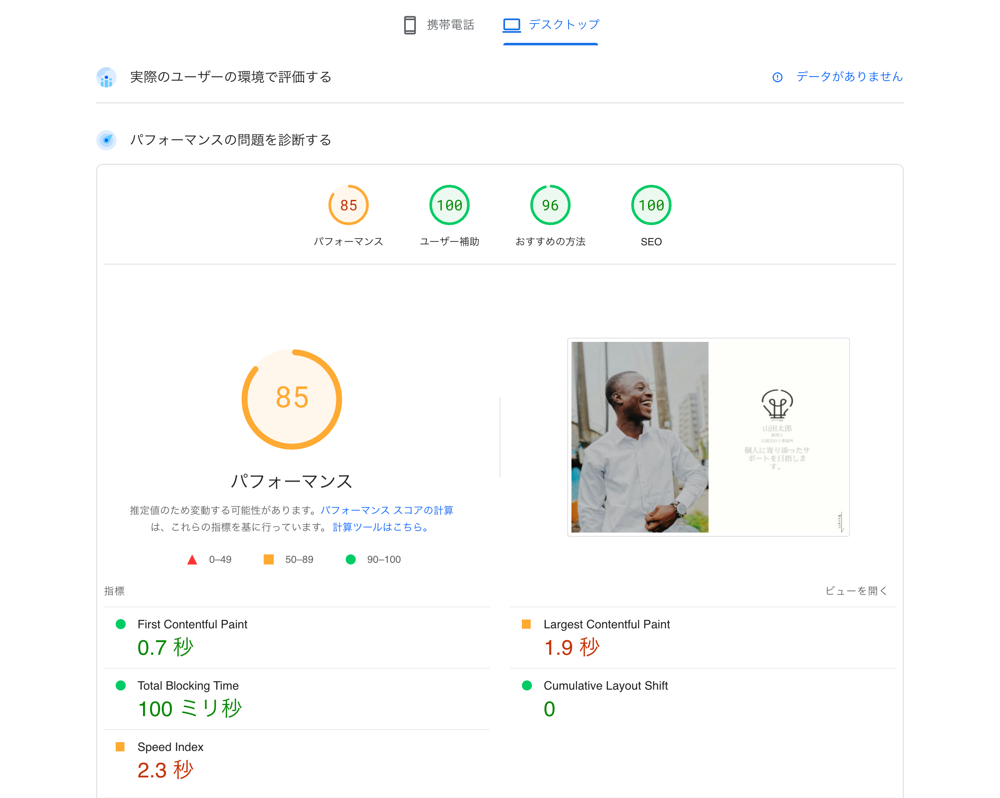
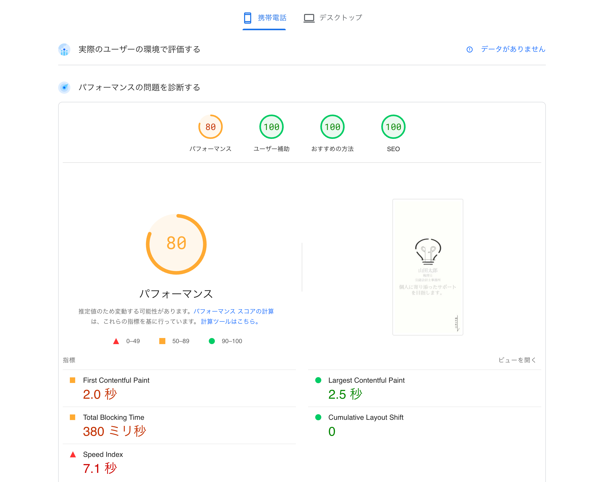

## <u>corporate-site01</u>

##### <概要>
友人から依頼され作成したコーポレートサイトです。
デザインからすべてを自分で作成しました。
安っぽいサイトにならないようにアニメーションを意識的に取り入れました。
[URL]: https://corporate-site01-for-public.vercel.app/

##### <製作日>

2024年2月（制作期間：約10日）

##### <仕様>

- バックエンド：なし
- レスポンシブ対応

##### <使用技術>

Next.js13(app router), Next.js, recoil, anime.js, tailwind, shadcn, typescript, etc

##### <パフォーマンス>

##### <参考URL>

<レスポンシブ>

- [tailwindcss Customizing Screens](https://tailwindcss.com/docs/screens)
- [responsively.app](https://responsively.app/)

<背景imageが実機で表示されない問題>

- [SVG Background Image の利用手順](https://qiita.com/mimonelu/items/68a57a8c3c5a89404e5b)
- [URLエンコード・デコードフォーム](https://www.tagindex.com/tool/url.html)
- [SVG filter makes element invisible in Safari and mobile Chrome](https://stackoverflow.com/questions/48109988/svg-filter-makes-element-invisible-in-safari-and-mobile-chrome)

<アニメーション>
- [画像が自動切り替わるCSSアニメーション](https://zenn.dev/ohtasoji/articles/16b7391074bcdb)
- [CodePen SVG line drawing animation](https://codepen.io/juliangarnier/pen/ZeEpgd)
- [矢印スクロールアニメーション](https://coco-factory.jp/ugokuweb/move01/9-1-4/)
- [【CSS】マーカー風のアンダーラインをつける](https://design-baum.jp/develop/877/)

<next/font>
- [Next.js 13×Tailwind @next/fontでGoogleFontsやローカルフォントを高速化してみる](https://zenn.dev/tsuyoshi/articles/894592ac677148)

<スマホで100vhがはみ出る問題>
- [スマホで100vhがはみ出るときの対策（ios,android)](https://devsakaso.com/javascript-100vh-problem-on-mobile-screens/)

<スマホでcss animationが反応しない問題>

- [CSSのanimationがiOSのChromeで動かない…transitionで対応](https://taupe.site/entry/css-animation-ios-chrome/#google_vignette)
- [JavaScript | スクロールで要素が画面内に入ったら実行するイベントの実装方法](https://1-notes.com/javascript-event-when-the-element-enters-the-screen-by-scrolling/#google_vignette)